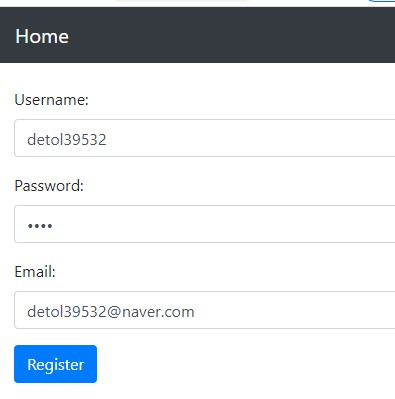
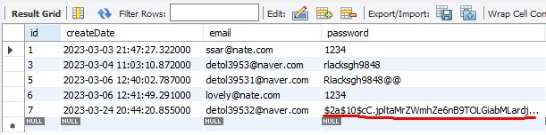

# 23/03/2023

### 로그인 페이지 커스터마이징 - Login Page Customizing

인증이 안된 사용자들이 출입할 수 있는 경로를 /auth/** 허용

그냥 주소가 / 이면 index.jsp 허용

static 이하에 있는 /js/**, /css/**, /image/** 허용

users who are not authenticated, they go to /auth/**

if the url is /... then users are allowed to use index page

static pages are viewed  /js/**, /css/** , /image/** 

#

### 유저가 로그인 되어있지 않다면, 로그인 화면으로 가진다

### If users are not logged in, they cannot go to index page

# 24/03/2023

### 비밀번호 해쉬암호화 - HASH PASSWORD

### 해쉬란
스트링형 비밀번호를 고정길이의 스트링값으로 변경해서 저장하는 방식

### Hashing
assigning a numeric or alphanumeric string to a piece of data by applying a hash function whose output values
are all the same number of bits in length

