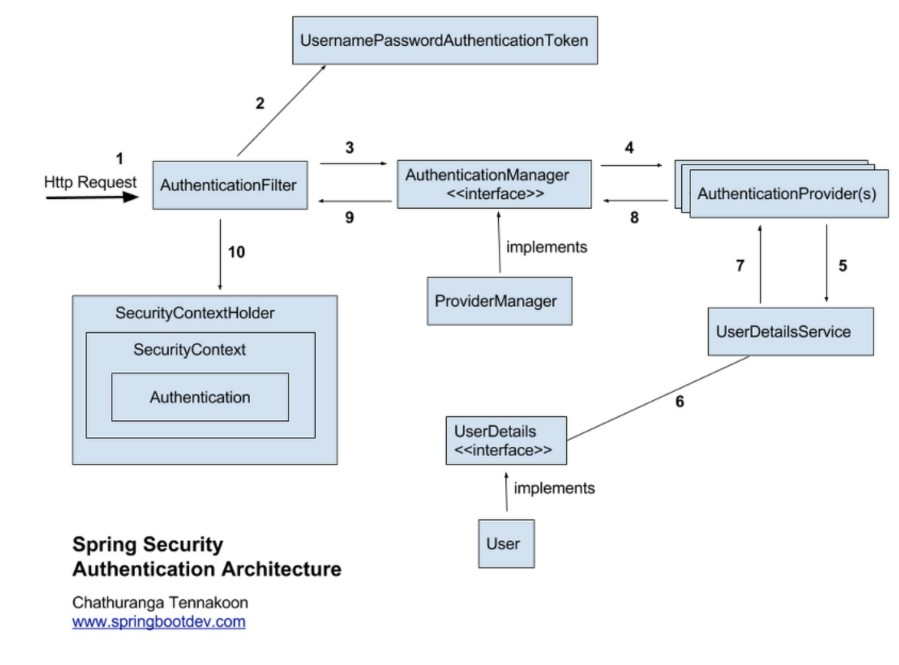

# 17/04/2023

### Edit Profile

# 18/04/2023

### Edit Profile

# 22/04/2023

### user can change user info and the user info in the database changes, however the user info does not change when we check it in user info again

### so we need to change session to show user info has changed in database

1) AuthenticationFilter gets the user info

2) AuthenticationManager makes The AuthenticationToken which has username and password

3) AuthenticationManager makes Authentication object and checks whether username and password exist in the database

4) AuthenticationManager encode the password to BCrypt hashed password and check the username and password in the database

5) Save authentication in Session if it exists.
