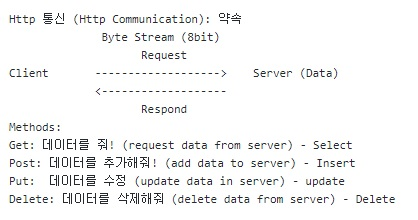
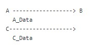
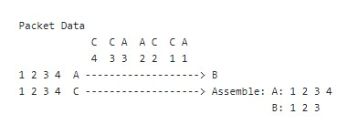
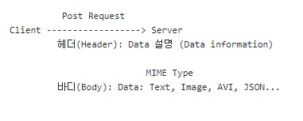

# 09/01/2023 
### MYSQL 과 Spring Boot 연결
### Connect MYSQL to Spring Boot

### application.yml
데이터 타입 yml은 JSON과 비슷한 형태를 가지며 스프링 부트의 대한 모든 설정을 이 파일에서 가능
The data type yml is similar to JSON and all kinds of spring boot settings such as web.xml 

# 10/01/2023
### Github와 Spring Boot 연결
### Connect Github to Spring Boot

매일의 블로그 프로젝트의 변화를 기록하고 관리하기위해서 깃헙을 사용
Github should be connected to Spring Boot as we may need to manage project files
by storing and tracking every changes and reports on every commits

# 11/01/2023
### Git의 3가지 영역: 작업영역(Folder), 인덱스(INDEX) 그리고 헤드(HEAD)
Git의 세가지 영역을 동기화 함으로써 프로젝트 형상관리가 가능합니다

# 13/01/2023
### HTTP1.1

### Stateful and Stateless

### Stateful

클라이언트와 서버간의 통신이 요청이나 응답이 끝나도 계속해서 연결돼 있는 구조이며 유저들이 인터넷을 통해서
기록이 가능하고 이전에 만들어진 정보로 다시 돌아와서 처리를 할수 있는 것.
Communication between client and server keeps connected and allow users to store
record and return to already established information and processes over the internet.클

### Stateless
클라이언트와 서버간의 통신이나 요청이 끝나면 바로 연결이 없어지며 이전에 교환이 저장되거나 참조 되어지지 않는 방식.
Communicaton between client and server keeps connected only when they communicate and then disconnected, which the previous transactions is neither stored nor referenced in subsequent transactions.

### HTTP Sessions

서버가 여러 클라이언트들의 요청과 응답사이의 특정 데이터를 유지하고 식별하기 위한 방법.
It is a standard feature that allows Web servers to maintain user identity and to store user-specific data during multiple request/response interactions between a client application and a Web application.

# 14/01/2023
         
Http Communication
회선 교환(Circuit Switching): 발신자와 수신자 사이의 연결이 1:1인 회선/채널
Two network nodes establish a dedicated communications channel (circuit) through the network before the nodes may communicate.
The circuit guarantees the full bandwidth of the channel and remains connected for the duration of the communication session.

패킷 교환(Packet Switching):  작은 블록의 패킷단위로 나눈 데이터를 전송하며 데이터를 전송하는 동안만 네트워크 자원을 사용하도록 하는 방법을 말한다
네트워크 자원을 패킷 단위로 나누어 시간을 공유하므로 회선 효율성이 높다
grouping data into packets that are transmitted over a digital network. 
Packets are made of a header and a payload. Data in the header is used by networking hardware to direct the packet to its destination,
where the payload is extracted and used by an operating system, application software, or higher layer protocols.
Packet switching is the primary basis for data communications in computer networks worldwide

###MIME (Multipurpose Internet Mail Extensions) 타입
MIME 타입은 이메일에 첨부된 파일을 텍스트 문자 형태로 변환해서 이메일과 함께 전송하기 위해 개발된 포맷이다
MIME type is a format to transmit the data such as image, document, text by changing it to text form on email.

                     
                     

