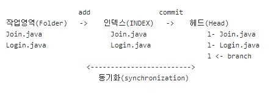

# 09/01/2023 
### MYSQL 과 Spring Boot 연결
### Connect MYSQL to Spring Boot

### application.yml
데이터 타입 yml은 JSON과 비슷한 형태를 가지며 스프링 부트의 대한 모든 설정을 이 파일에서 가능
The data type yml is similar to JSON and all kinds of spring boot settings such as web.xml 

# 10/01/2023
### Github와 Spring Boot 연결
### Connect Github to Spring Boot

매일의 블로그 프로젝트의 변화를 기록하고 관리하기위해서 깃헙을 사용. 
Github should be connected to Spring Boot as we may need to manage project files
by storing and tracking every changes and reports on every commits

# 11/01/2023
### Git의 3가지 영역: 작업영역(Folder), 인덱스(INDEX) 그리고 헤드(HEAD)
Git의 세가지 영역을 동기화 함으로써 프로젝트 형상관리가 가능합니다

