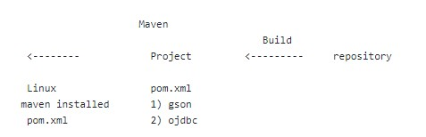

# 17/01/2023

Http Request 
Get(Select), Post(Insert), Put(Update), Delete(Delete)

### Java 객체지향 프로그래밍 (Object Oriented Programming)

1. 클래스 내에서의 변수값은 Private으로 생성.
Variances should be Private type in a class.

2. 변수값은 Method에 의해서 설정.
Variances should be changed by method in a class.

### Get Request on Params, Post Request on Body

Object mapping and parsing to use Json by Message Converter

# 20/01/23

### Build:
소스코드 파일을 컴퓨터에서 실행할 수 있는 독립 소프트웨어 가공물로 변환하는 과정 또는 그에 대한 결과물 이다.
it is a process to convert open source code file to use such as libraries and resources in a project.

### Maven:
- Maven은 필요한 라이브러리를 특정 문서(pom.xml)에 정의해 놓으면 내가 사용할 라이브러리 뿐만 아니라 해당 라이브러리가 작동하는데에 필요한 다른 라이브러리들까지 관리하여 네트워크를 통해서 자동으로 다운받아 준다.
a popular open-source build tool developed by the Apache Group to build, publish, and deploy several projects at once for better project management
In a project, pom.xml describes what resources and libraries are needed for the project and Maven downloads them from a central repository to use.

# 22/01/23

### Lombok Settings

# 24/01/23
### Lombok 
코드의 재사용과 반복을 줄여주며 어노테이션을 제공함으로써 시간을 절약 시켜주는 자바 라이브러리
a java library tool that is used to minimize/remove the boilerplate code and may save the development time by just using some annotations.

### @Builder 어노테이션의 장점:
1. 객체에 값을 넣을때 순서를 지키지 않아도 된다.
2. 객체 값 순서를 헷갈려서 객체의 값을 잘못 넣는 실수하는 것을 방지한다.
    
### @Builder Anotation:
1. when we put values in variables, we do not need to care about the order which is necessary in using constructors
2. may minimize any mistakes due to break the order

