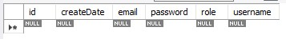

# 26/01/2023

### yml settings
server settings such as port, servlet, path are done in application.yml which is used in yaml rule

### return static data: htmp, img and jsp files on the web pages

# 28/01/2023

### Making Tables in the Database of the Blog

# 28/01/2023

