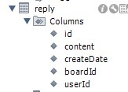
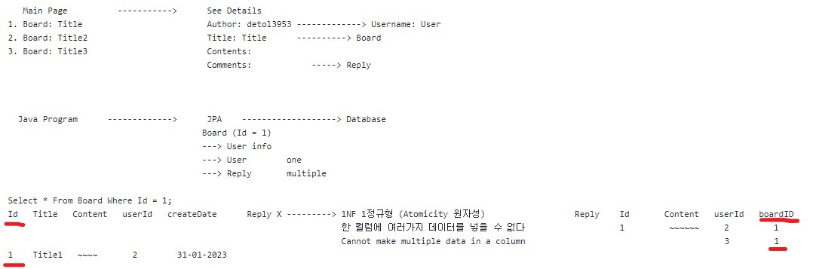

# 30/01/2023

### 답글 테이블 생성 - Creating reply table 

# 31/01/2023
### 연관관계 주인 

### JPA(Java Persistence API)
ORM(Object Relational Mapping)(객체-관계-매핑)
ORM: 객체와 데이터베이스의 관계를 매핑해주는 도구이다.
ORM is a tool to map objects to table to interact with relational database

JPA: 관계형 데이터베이스의 관리를 표현하는 자바 API
application programming interface specification that describes the management of relational data in enterprise Java applications.

# 01/02/2023

### JSON (JavaScript Object Notation)
JSON은 사람이 읽을 수 있는 텍스트 기반의 데이터 교환 표준입니다
데이터를 저장하거나 전송할때 JSON으로 표기하여 사람과 기게 모두가 읽기 쉬운 형태로 변환하여 용이하게 함

               Request
Body Data ------------------->  Controller
            JSON (MIME TYPE)

