# 13/02/23

### 삭제하기 테스트 (Delete Testing)

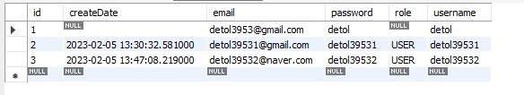

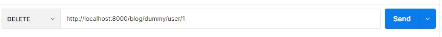

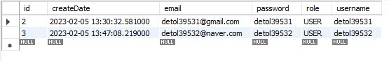

# 14/02/23

### 예외처리 (Exception) - GlobalHandlerException.java

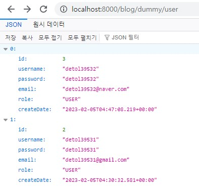

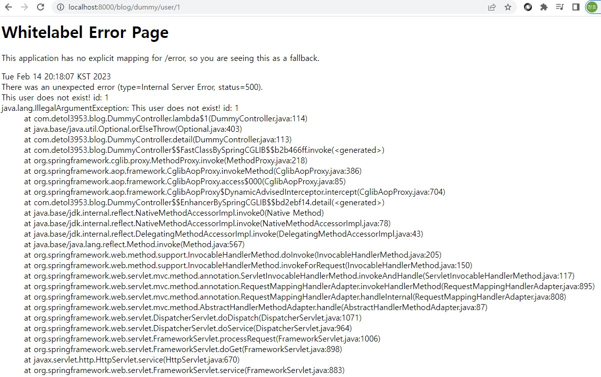

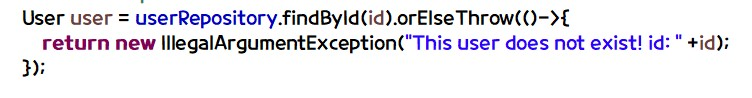

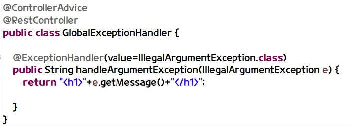

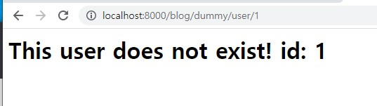

#

# 15/02/23

1. GET 요청 (Request)
http://localhost:8000/blog/user?=username=detol3953

- body로 데이터를 담아 보내지 않는다
- we do not send the data by putting into body

2. POST, PUT, DELETE 요청 (Request) - (Changing Data)
- 데이터를 담아 보내야 할 것이 많다.
- username, password, email, address, gender, createDate
- form 태그 method = 'POST'
- form 태그 -> get요청, post요청, (key=value)
- 자바스크립트로 요청

통일: 자바스크립트로 ajax 요청 -> 데이터는 json으로 통일

# 16/02/23 

### 메인화면 만들기
### 부트스트랩 사용 - Start Using BootStrap 4

1. index.jsp
Header (Navigation Bar) - https://www.w3schools.com/bootstrap4/bootstrap_navbar.asp
Footer - https://www.w3schools.com/bootstrap4/bootstrap_templates.asp
Container (Card) - https://www.w3schools.com/bootstrap4/tryit.asp?filename=trybs_card_image&stacked=h

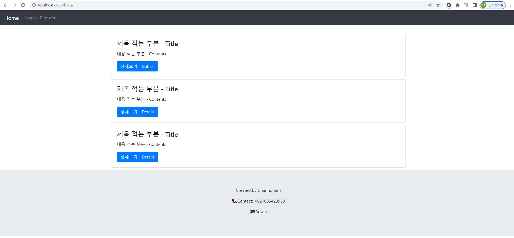

# 17/02/23

### 로그인 페이지 (Login Form) - loginForm.jsp
### 회원가입 페이지 (Register Form) - joinForm.jsp 

header.jsp, index.jsp, footer.jsp 세개로 나누기

<%@ include file="layout/header.jsp"%> 
index.jsp
<%@ include file="layout/footer.jsp"%>

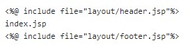

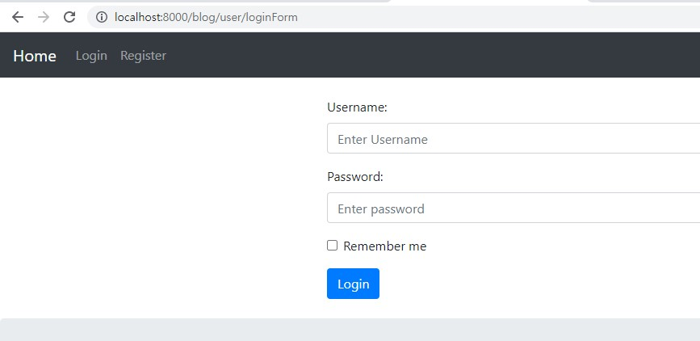

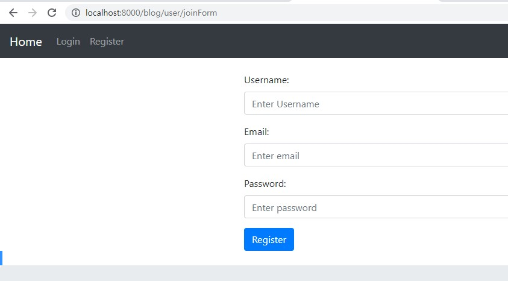

