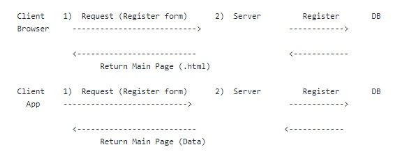
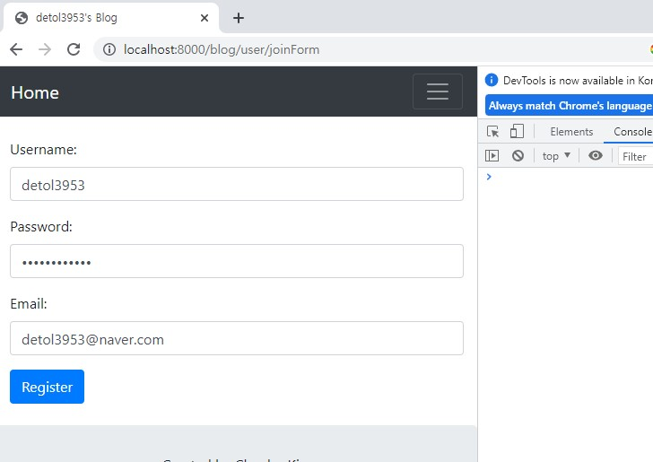
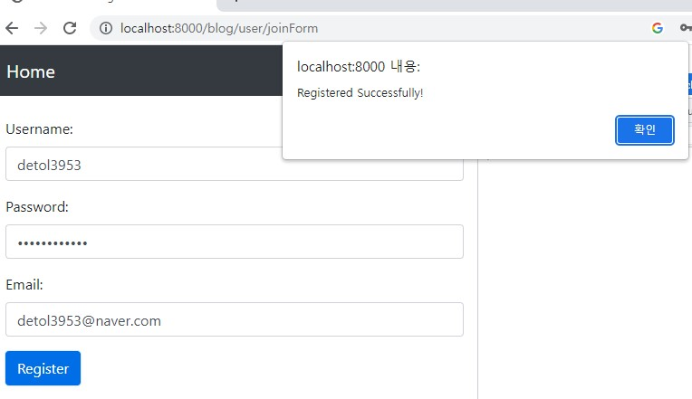

# 20/02/2023

### AJAX(Asynchronous JavaScript and XML) 사용 - Start Using AJAX

# 21/02/2023

### AJAX 를 사용하는 이유 - The reason why we use AJAX

### 1) 요청에 대한 응답을 html이 아닌 Data(JSON)을 받기 위해서 사용.

### To get JSON form of the data from the server after user request to the server.

Example:

           
                      

Data를 리턴하는 서버로 통일

We just need to make only one server to return data to client

### 2) 비동기 통신을 하기 위해서 - Asynchronous Communication

비동기처리 - 순서에 상관없이 일을 처리한다

Asynchronous processing - process the work without following the sequence of the procedure.

# 22/02/2023

### 회원가입 - AJAX 요청 
### Registration - AJAX Request

 
 
