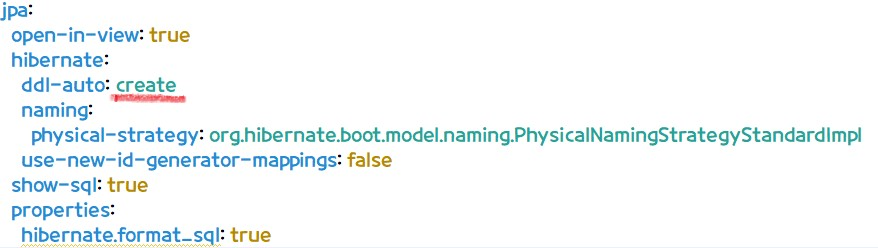
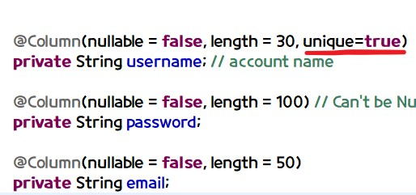
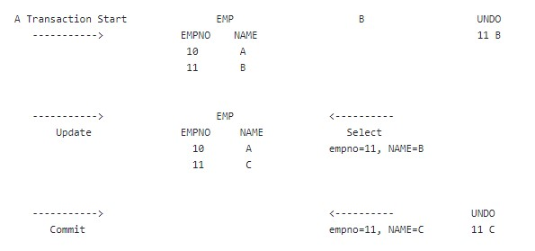
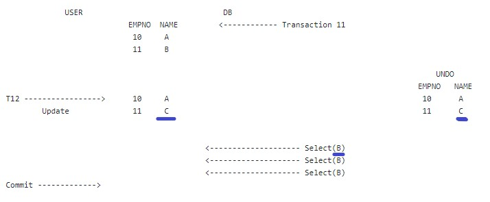
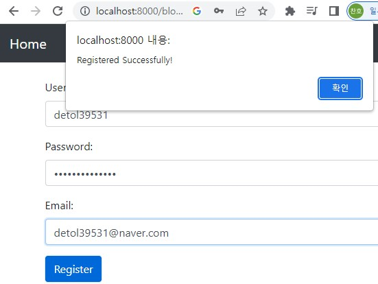

# 27/02/2023 

### Trouble Shooting

같은 이름의 ID가 생성되는것 수정
Fixed the problem that user can create same accounts multiple times

### Application.yml

### User.java

### DB 격리수준 - DB Isolation Level

트랜잭션: 일을 처리하기 위한 가장 작은 단위
Transaction: a smallest single unit to work and process

### Oracle - Read and Commit

   

# 28/02/2023 

### MYSQL Isolation Level

### MYSQL - Repeatable Read

Mysql은 InnoDB Storage Engine을 사용함

Mysql uses InnoDB Storage Engine 

Repeatable Read: 하나의 트랜잭션 내에서 동일 select 쿼리를 실행했을 때는 항상 같은 결과를 가져와야 한다는 정합성 정의

Repeatable Read: In a transaction, the same select queries must have same result 

  
                      
                      
# 02/03/2023

### SPRING JPA and OSIV Strategy

# 03/03/2023

### 로그인 - Login

